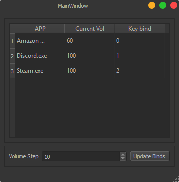

# Volume_Buddy
Windows volume mixer, change the volume of individual processes with key binds!

Volume buddy allows the user to change individual volume of applications using key board shortcuts. You no longer have to disturb
your workflow, remove the need to minimise your current focused app to change a volume of a program.



# Features

• GUI interface:
```
    • Shows current audio streaming applications: Name, Current Volume, Current Bind
    • Dynamically change the volume step
    • Dynamically change the bound key to any app
```
• Change any app which streams audio in windows.

• Custom key binds.

• Change the volume step.

• Group applications to 1 key bind.

# Usage

A distributed exe can be found in the releases tab if you don't wish to set up the development environment.

Setting up the dev enviroment:
```
• Python 3.X (tested with 3.7)
• Windows 7 or newer
• Dependencies:
    - keyboard: https://github.com/boppreh/keyboard
    - pycaw: https://github.com/AndreMiras/pycaw
    - PyQt5
```

Using the app is simple, set the binds you want in the bind column of the table. for example if you want to be bound to 'a' simply input 'a' in the third column
and press the 'update bind' button.

Volumn up bind: 'Left shift' + [assigned bind] + 'Page Up'

Volumn down bind: 'Left shift' + [assigned bind] + 'Page Down'

To adjust the volume step simply change the value in the spin box.

# Upcoming Features
• User defined hard key binds.

• Checking if the binds are valid (no checking currently!).

• Small bug fixes and optimisations.

• GUI improvements.

• Support for Linux and OSX (if any intrest).

• Full c++ version (this was just a quick throw together as I was getting annoyed minimising to change amazon musics volume).


